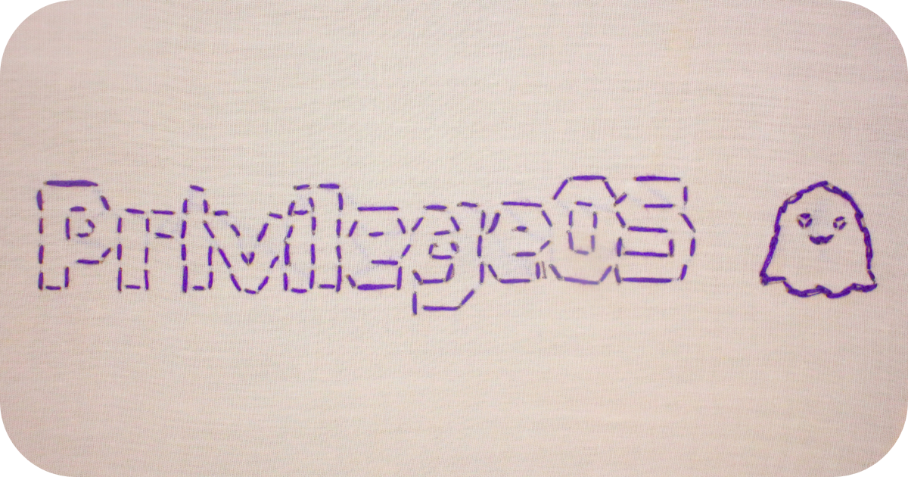

# PrivilegeOS

**A specialized Linux distribution designed for penetration testing and Windows admin access bypass**



## 📋 Table of Contents

* [Overview](#-overview)
* [Features](#-features)
* [System Requirements](#-system-requirements)
* [Installation](#-installation)
* [Usage](#-usage)
* [Built-in Tools](#️-built-in-tools)
* [Windows Admin Bypass](#-windows-admin-bypass)
* [Building from Source](#-building-from-source)
* [Configuration](#️-configuration)
* [Troubleshooting](#-troubleshooting)
* [Security Notice](#-security-notice)
* [Contributing](#-contributing)
* [License](#-license)
* [Changelog](#-changelog)
* [Acknowledgments](#-acknowledgments)

## IMPORTANT LEGAL NOTICE

**PrivilegeOS is intended for AUTHORIZED SECURITY TESTING ONLY**

### Permitted Use
- ✅ Systems you own
- ✅ Authorized penetration testing with written consent
- ✅ Educational environments and labs
- ✅ Security research with proper permissions

### Prohibited Use
- ❌ Unauthorized access to any system
- ❌ Any illegal or malicious activities
- ❌ Use without explicit written permission
- ❌ Violating any local, state, or federal laws

### User Responsibility
By downloading, using, or distributing this software, you acknowledge:
1. You will only use this tool on systems you own or have explicit authorization to test
2. You are responsible for complying with all applicable laws
3. You will not use this tool for unauthorized access or malicious purposes
4. You understand the legal implications of using penetration testing tools

### No Warranty
This software is provided "AS IS" without warranty of any kind.
The authors are not liable for any damages or legal consequences.

## Educational Purpose Statement

PrivilegeOS is developed for:
- **Cybersecurity education** and training
- **Defensive security** understanding
- **Authorized vulnerability assessment**
- **Security research** and improvement

This tool helps security professionals and students understand:
- How these attacks work
- How to detect such attacks
- How to defend against these techniques
- Proper security testing methodologies

## 🔍 Overview

PrivilegeOS is a minimal, bootable Linux distribution built specifically for penetration testing scenarios involving Windows systems. It features native NTFS3 kernel support, custom penetration testing tools, and specialized utilities for Windows admin access bypass techniques.

**Key Characteristics:**
- **Lightweight**: ~35MB bootable image
- **Fast Boot**: Boots in under 30 seconds
- **No Installation Required**: Runs entirely from USB/CD
- **Root Access**: Automatic root login
- **NTFS3 Support**: Native kernel NTFS driver for reliable Windows filesystem access
- **UEFI Compatible**: Modern firmware support

## ✨ Features

### Core System
- **Linux Kernel**: 6.15.3 with custom configuration
- **Init System**: BusyBox with custom scripts
- **Filesystem Support**: NTFS3 (native), FAT32, EXT4, XFS, BTRFS
- **Network Support**: Ethernet and Wi-Fi drivers
- **Storage Support**: SATA, NVMe, USB storage devices
- **Graphics Support**: Intel, AMD, NVIDIA drivers

### Security Tools
- **Windows Admin Bypass**: Sticky keys replacement technique
- **NTFS Mount Tools**: Advanced NTFS mounting with various options
- **Drive Analysis**: Comprehensive partition and filesystem detection
- **Network Tools**: Basic network diagnostics and configuration
- **Hibernation Handling**: Automatic hibernation file detection and removal

### User Experience
- **Automatic Boot**: No user interaction required
- **Color-coded Interface**: Easy-to-read terminal output
- **Command Aliases**: Simplified commands for common operations
- **Help System**: Built-in documentation and examples

## 💻 System Requirements

### Minimum Requirements
- **CPU**: x86-64 compatible processor
- **RAM**: 1GB (2GB recommended)
- **Storage**: 1GB available space for USB creation
- **Firmware**: UEFI or Legacy BIOS support

### Recommended Requirements
- **CPU**: Intel Core i3 or AMD equivalent
- **RAM**: 4GB or more
- **Storage**: USB 3.0+ drive for faster boot times
- **Network**: Ethernet or Wi-Fi adapter

### Supported Hardware
- **Storage Controllers**: AHCI, NVMe, USB
- **Network Adapters**: Intel, Realtek, Atheros, Broadcom
- **Graphics Cards**: Intel integrated, AMD, NVIDIA
- **Input Devices**: USB keyboards, mice, touchpads

## 🚀 Installation

### Quick Start

1. **Download** the latest PrivilegeOS image:
   ```bash
   wget https://github.com/ktauchathuranga/privilegeos/releases/latest/PrivilegeOS.img
   ```

2. **Write to USB** drive (replace `/dev/sdX` with your USB device):
   ```bash
   sudo dd if=PrivilegeOS.img of=/dev/sdX bs=8M status=progress conv=fsync
   ```

3. **Boot** from USB drive:
   - Enable UEFI boot in BIOS/firmware settings
   - Select USB drive as boot device
   - PrivilegeOS will boot automatically

### Alternative Methods

#### Using Balena Etcher (GUI)
1. Download [Balena Etcher](https://www.balena.io/etcher/)
2. Select PrivilegeOS.img file
3. Select your USB drive
4. Click "Flash"

#### Using Rufus (Windows)
1. Download [Rufus](https://rufus.ie/)
2. Select your USB drive
3. Select PrivilegeOS.img as boot selection
4. Set partition scheme to GPT
5. Click "START"

## 💾 USB Writing Tool

PrivilegeOS includes a dedicated USB writing tool (`boot.sh`) for easy image deployment to USB drives.

### Using boot.sh

The `boot.sh` script provides a safe and convenient way to write PrivilegeOS images to USB drives with built-in safety checks and verification.

#### Basic Usage

```bash
# Interactive mode (will prompt for device selection)
./boot.sh

# List available block devices
./boot.sh --list

# Write to specific device
./boot.sh --device sdb

# Automated mode (skip confirmations)
./boot.sh --device sdb --yes

# Use custom image file
./boot.sh --image /path/to/custom.img --device sdb

# Use custom OS name for display
./boot.sh --name MyCustomOS --device sdc
```

#### Command Line Options

| Option | Description | Example |
|--------|-------------|---------|
| `-h, --help` | Show help message and exit | `--help` |
| `-i, --image FILE` | Specify disk image file | `--image custom.img` |
| `-n, --name NAME` | Set OS name for display | `--name "Custom PrivilegeOS"` |
| `-y, --yes` | Skip confirmation prompts | `--yes` |
| `-d, --device DEVICE` | Specify target device | `--device sdb` |
| `-l, --list` | List available block devices | `--list` |

#### Safety Features

The `boot.sh` script includes comprehensive safety measures:

- **System Drive Protection**: Automatically detects and prevents writing to system drives
- **Device Validation**: Verifies device existence and type before writing
- **Mount Check**: Automatically unmounts any mounted partitions on target device
- **Size Verification**: Ensures USB drive is large enough for the image
- **Confirmation Prompts**: Requires explicit confirmation before destructive operations
- **Write Verification**: Performs basic verification after writing

#### Example Usage Sessions

**Interactive Mode:**
```bash
$ ./boot.sh

PrivilegeOS USB Writer
Image: build/PrivilegeOS.img

Available drives:
NAME    SIZE MODEL             VENDOR   TYPE
sdb     32G  Extreme           SanDisk  disk
sdc     64G  DataTraveler_3.0  Kingston disk

Enter the device name to write to (e.g., sdb, NOT sdb1): sdb

WARNING: YOU ARE ABOUT TO OVERWRITE /dev/sdb
ALL DATA ON THIS DEVICE (32G) WILL BE LOST!
Device: /dev/sdb
Image file: build/PrivilegeOS.img (35M)
OS: PrivilegeOS

Type 'YES' to continue: YES

Writing image to /dev/sdb...
35+0 records in
35+0 records out
536870912 bytes (36 MB, 35 MiB) copied, 45.2s, 11.9 MB/s

SUCCESS: PrivilegeOS has been written to /dev/sdb
You can now boot your computer from this USB drive.
```

**Automated Mode:**
```bash
# Write to sdb without prompts
./boot.sh --device sdb --yes

# Use custom image and skip prompts
./boot.sh --image /path/to/my-privilegeos.img --device sdc --yes
```

#### Error Handling

The script provides clear error messages for common issues:

```bash
# Device doesn't exist
ERROR: Device /dev/sdz does not exist or is not a block device.

# USB drive too small
ERROR: USB drive is too small (16G) for the image (32G).

# Trying to write to system drive
ERROR: You're trying to write to the system's boot disk! Operation aborted.

# Image file not found
ERROR: Disk image not found: missing.img
```

#### Log Files

All operations are logged to `build/logs/boot.log` for troubleshooting and audit purposes.

## 📖 Usage

### First Boot

When PrivilegeOS boots, you'll see:

```
  ____       _       _ _                  ___  ____  
 |  _ \ _ __(_)_   _(_) | ___  __ _  ___ / _ \/ ___| 
 | |_) | '__| \ \ / / | |/ _ \/ _` |/ _ \ | | \___ \ 
 |  __/| |  | |\ V /| | |  __/ (_| |  __/ |_| |___) |
 |_|   |_|  |_| \_/ |_|_|\___|\__, |\___|\___/|____/ 
                              |___/                 

Welcome to PrivilegeOS!
Build date: 2025-07-06 11:51:07
You are running as: ROOT

Hardware Information:
====================
Intel(R) Core(TM) i7-8750H CPU @ 2.20GHz
Memory: 1024/8192 MB
NTFS3 support: AVAILABLE (native kernel driver)

Custom commands available:
  - getadmin
  - putadmin
  - getdrives

Type 'poweroff' or 'reboot' to exit.
To mount NTFS drives: mount -t ntfs3 /dev/sdXN /mnt

/ # 
```

### Basic Commands

```bash
# List all storage devices
getdrives

# Mount NTFS partition
mount -t ntfs3 /dev/sda2 /mnt

# Navigate mounted drive
cd /mnt
ls -la

# Windows admin bypass
getadmin --help
getadmin -f -d

# Restore Windows to normal
putadmin --help
putadmin -f -d

# Network configuration
ip addr show
ip link set eth0 up
```

### Command Reference

| Command | Description | Example |
|---------|-------------|---------|
| `getdrives` | List all drives and partitions | `getdrives` |
| `getadmin` | Windows admin bypass tool | `getadmin -f -d` |
| `putadmin` | Restore Windows to normal | `putadmin -f -d` |
| `mount-ntfs` | Mount NTFS partition (alias) | `mount-ntfs /dev/sda2 /mnt` |
| `poweroff` | Shutdown system | `poweroff` |
| `reboot` | Restart system | `reboot` |

## 🛠️ Built-in Tools

### Drive Management Tools

#### `getdrives`
Comprehensive drive and partition analysis tool.

**Features:**
- Partition table display
- Filesystem detection
- Mount status
- Disk usage information
- NTFS3 compatibility check

**Usage:**
```bash
getdrives
```

**Output Example:**
```
===============================================
            STORAGE DEVICES LIST
===============================================

Partition Table:
MAJOR MINOR  #BLOCKS  NAME
8        0  488386584 sda
8        1     204800 sda1
8        2  488179712 sda2

Filesystem Detection:
/dev/sda1: vfat
/dev/sda2: ntfs

NTFS3 Commands (Native Kernel Driver):
Mount NTFS partition: mount -t ntfs3 /dev/sdXN /mnt
Mount NTFS read-only: mount -t ntfs3 -o ro /dev/sdXN /mnt
```

### Windows Admin Bypass Tools

#### `getadmin`
Advanced Windows admin access bypass tool using sticky keys replacement.

**Features:**
- Automatic Windows partition detection
- Hibernation file handling and optional deletion
- File integrity verification
- Multiple mount options
- Comprehensive logging
- Legal authorization confirmation

**Usage:**
```bash
# Basic usage
getadmin

# Force mount with hibernation file deletion
getadmin --force --delete-hiberfil

# Show help
getadmin --help
```

**Options:**
- `-f, --force`: Use force option when mounting NTFS partitions
- `-d, --delete-hiberfil`: Delete hiberfil.sys if found (helps with hibernated Windows)
- `-h, --help`: Show help message

**Note on hibernation file deletion:**
- Allows proper NTFS mounting of hibernated Windows systems
- Prevents Windows from resuming from hibernation (cold boot instead)
- Frees up disk space (hiberfil.sys can be several GB)

#### `putadmin`
Windows system restoration tool to reverse getadmin modifications.

**Features:**
- Automatic backup detection
- File restoration verification
- Cleanup of temporary files
- Safety checks and confirmations
- Hibernation file handling and optional deletion
- Complete system restoration

**Usage:**
```bash
# Basic restoration
putadmin

# Force restoration with hibernation file deletion
putadmin --force --delete-hiberfil

# Show help
putadmin --help
```

**Options:**
- `-f, --force`: Use force option when mounting NTFS partitions
- `-d, --delete-hiberfil`: Delete hiberfil.sys if found (helps with hibernated Windows)
- `-h, --help`: Show help message

**Note:** `putadmin` now includes the same hibernation file handling capabilities as `getadmin`, making it consistent and able to handle hibernated Windows systems during restoration.

## 🔧 Windows Admin Bypass

### Overview

PrivilegeOS includes a sophisticated Windows admin bypass system that uses the "sticky keys" replacement technique. This method is commonly used in penetration testing to gain administrative access to Windows systems.

### How It Works

1. **Detection**: Script scans for Windows NTFS partitions
2. **Hibernation Check**: Detects and optionally removes hibernation files
3. **Mounting**: Mounts Windows filesystem with write access
4. **Backup**: Creates backup of original system files
5. **Replacement**: Replaces `sethc.exe` with `cmd.exe`
6. **Verification**: Confirms operation success

### Usage Process

#### Step 1: Boot PrivilegeOS
Boot from USB and wait for the command prompt.

#### Step 2: Run getadmin
```bash
/ # getadmin --force --delete-hiberfil
```

**Note:** The tool will prompt for legal authorization confirmation before proceeding.

#### Step 3: Boot Windows
Restart and boot into Windows normally.

#### Step 4: Access Admin Shell
At the Windows login screen, press `Shift` five times. Instead of sticky keys, a command prompt with SYSTEM privileges will open.

#### Step 5: Create Admin User
```cmd
net user administrator /active:yes
net user newadmin password123 /add
net localgroup administrators newadmin /add
```

#### Step 6: Restore System (Optional)
Boot back into PrivilegeOS and run:
```bash
/ # putadmin --force --delete-hiberfil
```

### Hibernation File Handling

Both `getadmin` and `putadmin` can handle Windows hibernation files:

#### Automatic Detection
- Detects `hiberfil.sys` presence automatically
- Shows file size and hibernation status
- Warns about hibernation implications

#### Optional Deletion
- Use `--delete-hiberfil` flag to automatically delete hibernation file
- Prompts for confirmation before deletion
- Verifies successful deletion
- Frees up disk space (often several GB)

#### Benefits of Deletion
- Allows proper NTFS mounting of hibernated systems
- Prevents Windows hibernation resume issues
- Provides cleaner system state for modifications

### Security Considerations

⚠️ **WARNING**: This technique should only be used on systems you own or have explicit permission to test.

- **Legal**: Ensure you have proper authorization
- **Detection**: May be detected by security software
- **Forensics**: Leaves traces in system logs
- **Backup**: Always create backups before modification
- **Hibernation**: Deletion prevents hibernation resume (unsaved work will be lost)

## 🔨 Building from Source

### Prerequisites

#### Required Packages (Ubuntu/Debian)
```bash
sudo apt-get update
sudo apt-get install -y \
    build-essential \
    gcc \
    make \
    bc \
    libncurses-dev \
    flex \
    bison \
    libelf-dev \
    libssl-dev \
    qemu-system-x86_64 \
    ovmf \
    parted \
    dosfstools \
    wget \
    xz-utils
```

#### Required Packages (Fedora/CentOS)
```bash
sudo dnf install -y \
    gcc \
    make \
    bc \
    ncurses-devel \
    flex \
    bison \
    elfutils-libelf-devel \
    openssl-devel \
    qemu-system-x86 \
    edk2-ovmf \
    parted \
    dosfstools \
    wget \
    xz
```

### Build Process

#### 1. Clone Repository
```bash
git clone https://github.com/ktauchathuranga/privilegeos.git
cd privilegeos
```

#### 2. Basic Build
```bash
./build.sh
```

#### 3. Custom Build Options
```bash
# Clean build with custom size
./build.sh --clean --size 1024 --threads 8

# QEMU-only testing
./build.sh --qemu-only

# Custom kernel and BusyBox versions
./build.sh --kernel 6.15.3 --busybox 1.36.1

# Use custom configurations
./build.sh --kernel-config my_kernel.config --busybox-config my_busybox.config
```

#### 4. Build Options Reference

| Option | Description | Example |
|--------|-------------|---------|
| `--clean` | Clean build directory | `--clean` |
| `--size SIZE` | Disk image size in MB | `--size 1024` |
| `--threads N` | Compilation threads | `--threads 8` |
| `--memory SIZE` | QEMU memory size | `--memory 4G` |
| `--qemu-only` | Test in QEMU only | `--qemu-only` |
| `--skip-qemu` | Skip QEMU testing | `--skip-qemu` |
| `--kernel-config FILE` | Custom kernel config | `--kernel-config my.config` |
| `--busybox-config FILE` | Custom BusyBox config | `--busybox-config my.config` |

### Adding Custom Scripts

#### 1. Create Script Directory
```bash
mkdir -p scripts
```

#### 2. Add Your Scripts
```bash
# Example custom script
cat > scripts/myscript.sh << 'EOF'
#!/bin/sh
echo "Hello from custom script!"
EOF
chmod +x scripts/myscript.sh
```

#### 3. Rebuild
```bash
./build.sh
```

#### 4. Use in PrivilegeOS
After rebuilding, your script will be available as:
```bash
/ # myscript
Hello from custom script!
```

### Build Directory Structure

```
privilegeos/
├── build.sh                  # Main build script
├── scripts/                  # Custom scripts directory
│   ├── getadmin.sh          # Windows admin bypass tool
│   ├── putadmin.sh          # Windows restoration tool
│   └── getdrives.sh         # Drive analysis tool
├── configs/                 # Configuration files
│   ├── kernel.config        # Kernel configuration
│   └── busybox.config       # BusyBox configuration
├── build/                   # Build output directory
│   ├── PrivilegeOS.img      # Final disk image
│   ├── initramfs/           # Root filesystem
│   └── logs/                # Build logs
├── linux-6.15.3/           # Kernel source (downloaded)
├── busybox-1.36.1/          # BusyBox source (downloaded)
└── README.md                # This file
```

## ⚙️ Configuration

### Kernel Configuration

The kernel is configured with these key features:

#### Filesystem Support
- **NTFS3**: Native kernel NTFS driver
- **FAT32/VFAT**: Windows filesystem support
- **EXT4**: Linux filesystem support
- **XFS/BTRFS**: Advanced filesystems

#### Hardware Support
- **Storage**: AHCI, NVMe, USB storage
- **Network**: Ethernet and Wi-Fi drivers
- **Graphics**: Intel, AMD, NVIDIA drivers
- **Input**: USB keyboards and mice

#### Security Features
- **EFI**: UEFI boot support
- **Framebuffer**: Console graphics support
- **Serial**: Debug console support

### BusyBox Configuration

BusyBox is configured with these utilities:

#### Core Utilities
- `ls`, `cp`, `mv`, `rm`, `mkdir`, `rmdir`
- `cat`, `more`, `less`, `grep`, `sed`, `awk`
- `tar`, `gzip`, `gunzip`, `find`, `which`

#### System Utilities
- `mount`, `umount`, `df`, `du`, `free`
- `ps`, `top`, `kill`, `killall`
- `chmod`, `chown`, `chgrp`

#### File Utilities
- `blkid`, `fdisk`, `lsblk`
- `mkfs.vfat`, `fsck`

### Custom Configurations

#### Mount Options
```bash
# NTFS read-write with full permissions
mount -t ntfs3 -o rw,uid=0,gid=0,fmask=133,dmask=022 /dev/sda2 /mnt

# NTFS read-only
mount -t ntfs3 -o ro /dev/sda2 /mnt

# NTFS with force (hibernated systems)
mount -t ntfs3 -o rw,force /dev/sda2 /mnt
```

## 🔧 Troubleshooting

### Common Issues

#### Boot Issues

**Problem**: System doesn't boot from USB
**Solutions:**
1. Verify UEFI boot is enabled in BIOS
2. Disable Secure Boot if enabled
3. Try different USB ports (USB 2.0 vs 3.0)
4. Re-write image to USB with different tool

**Problem**: Kernel panic on boot
**Solutions:**
1. Check hardware compatibility
2. Try booting with `acpi=off` parameter
3. Verify image integrity with checksum

#### NTFS Mounting Issues

**Problem**: Cannot mount NTFS partition
**Solutions:**
1. Check if NTFS3 is available: `grep ntfs3 /proc/filesystems`
2. Try force mounting: `mount -t ntfs3 -o rw,force /dev/sdX /mnt`
3. Check for hibernation: look for `hiberfil.sys`
4. Use hibernation deletion: `getadmin --delete-hiberfil` or `putadmin --delete-hiberfil`
5. Verify partition exists: `fdisk -l`

**Problem**: "Read-only file system" error
**Solutions:**
1. Remount with write permissions: `mount -o remount,rw /mnt`
2. Check filesystem errors: `fsck.ntfs /dev/sdX`
3. Remove hibernation file: `rm /mnt/hiberfil.sys` or use `--delete-hiberfil`

#### getadmin Issues

**Problem**: No Windows partition found
**Solutions:**
1. Use force option: `getadmin --force`
2. Check partitions manually: `getdrives`
3. Try different mount options
4. Use hibernation deletion: `getadmin --force --delete-hiberfil`
5. Verify Windows is not BitLocker encrypted

**Problem**: Permission denied errors
**Solutions:**
1. Check file permissions: `ls -la /mnt/Windows/System32/`
2. Try changing permissions: `chmod 755 /mnt/Windows/System32/sethc.exe`
3. Use force mount option
4. Remove hibernation file: `getadmin --delete-hiberfil`
5. Check for file attributes: `lsattr /mnt/Windows/System32/sethc.exe`

**Problem**: Hibernation file conflicts
**Solutions:**
1. Use hibernation deletion: `getadmin --delete-hiberfil`
2. Manual deletion: `rm /mnt/hiberfil.sys`
3. Boot Windows normally first, then shut down properly
4. Use force mount: `getadmin --force`

#### putadmin Issues

**Problem**: Cannot restore system
**Solutions:**
1. Use force option: `putadmin --force`
2. Check for backup files: `ls -la /mnt/Windows/System32/sethc.exe.backup`
3. Handle hibernation: `putadmin --force --delete-hiberfil`
4. Verify system was previously modified by getadmin

**Problem**: Bypass doesn't work in Windows
**Solutions:**
1. Verify file sizes changed: `ls -la /mnt/Windows/System32/sethc.exe`
2. Check backup was created: `ls -la /mnt/Windows/System32/sethc.exe.backup`
3. Try restoration and re-application: `putadmin` then `getadmin`
4. Check Windows version compatibility

### Debug Information

#### System Information
```bash
# Check kernel version and modules
uname -a
lsmod | grep ntfs

# Check loaded filesystems
cat /proc/filesystems

# Check memory usage
free -m

# Check storage devices
cat /proc/partitions
```

#### Network Debugging
```bash
# Check network interfaces
ip addr show

# Check network connectivity
ping 8.8.8.8

# Check DNS resolution
nslookup google.com
```

#### Storage Debugging
```bash
# Check block devices
lsblk

# Check filesystem types
blkid

# Check mount points
mount | grep /dev/

# Check disk usage
df -h

# Check for hibernation files
find /mnt -name "hiberfil.sys" -ls 2>/dev/null
```

### Log Files

#### Build Logs
- `build/logs/build.log` - Main build log
- `build/logs/kernel_build.log` - Kernel compilation log
- `build/logs/busybox_build.log` - BusyBox compilation log

#### Runtime Logs
- `/var/log/dmesg.log` - Kernel messages
- `/tmp/rcS_started` - Init script status
- `/tmp/rcS_completed` - Init completion status

### Getting Help

#### Community Support
- **GitHub Issues**: [Report bugs and request features](https://github.com/ktauchathuranga/privilegeos/issues)
- **Discussions**: [Ask questions and share tips](https://github.com/ktauchathuranga/privilegeos/discussions)

## 🔒 Security Notice

### Legal Disclaimer

**PrivilegeOS is designed for educational and authorized penetration testing purposes only.**

By using this software, you acknowledge that:

1. **Authorization Required**: You will only use this tool on systems you own or have explicit written permission to test
2. **Legal Compliance**: You will comply with all applicable local, state, and federal laws
3. **No Malicious Use**: You will not use this tool for unauthorized access, data theft, or malicious purposes
4. **Educational Purpose**: This tool is intended for learning about security vulnerabilities and defensive measures

### Ethical Guidelines

#### Responsible Disclosure
If you discover vulnerabilities using PrivilegeOS:
1. Report to the affected vendor first
2. Allow reasonable time for patching
3. Follow coordinated disclosure practices
4. Do not exploit for personal gain

#### Professional Use
For security professionals:
1. Obtain proper authorization before testing
2. Document all activities for client records
3. Follow industry best practices
4. Provide constructive remediation advice

### Technical Security

#### Detection Avoidance
This tool may be detected by:
- Antivirus software
- Host-based intrusion detection systems
- File integrity monitoring
- Behavioral analysis tools

#### Forensic Considerations
This tool may leave traces including:
- Modified system files
- Backup files in System32
- Registry changes (if additional tools used)
- Event log entries
- Deleted hibernation files

## 🤝 Contributing

We welcome contributions from the security community!

### Development Process

#### 1. Fork the Repository
```bash
git clone https://github.com/ktauchathuranga/privilegeos.git
cd privilegeos
git checkout -b feature/my-new-feature
```

#### 2. Make Changes
- Follow existing code style
- Add comprehensive comments
- Test thoroughly
- Update documentation

#### 3. Submit Pull Request
- Describe changes clearly
- Include test results
- Reference any related issues
- Sign commits with GPG key

### Contribution Guidelines

#### Code Standards
- **Shell Scripts**: Follow POSIX shell standards
- **Documentation**: Use clear, concise language
- **Comments**: Explain complex logic
- **Error Handling**: Include comprehensive error checking

#### Testing Requirements
- Test on multiple hardware configurations
- Verify UEFI and Legacy BIOS compatibility
- Test with various Windows versions
- Test hibernation file handling
- Document any limitations or known issues

#### Documentation Updates
- Update README for new features
- Add help text for new commands
- Include usage examples
- Update troubleshooting section

### Development Environment

#### Setting Up Development Environment
```bash
# Install development dependencies
sudo apt-get install -y build-essential git

# Clone repository
git clone https://github.com/ktauchathuranga/privilegeos.git
cd privilegeos

# Create development branch
git checkout -b develop
```

#### Testing Changes
```bash
# Test build process
./build.sh --qemu-only

# Test specific components
./build.sh --clean --skip-qemu

# Test in virtual machine
qemu-system-x86_64 -bios /usr/share/ovmf/x64/OVMF.fd -drive file=build/PrivilegeOS.img,format=raw
```

## 📄 License

### Third-Party Licenses

#### Linux Kernel
Licensed under GNU General Public License v2.0
- **Source**: https://kernel.org/
- **License**: https://www.gnu.org/licenses/gpl-2.0.html

#### BusyBox
Licensed under GNU General Public License v2.0
- **Source**: https://busybox.net/
- **License**: https://www.gnu.org/licenses/gpl-2.0.html

#### Additional Components
All other components maintain their respective licenses. See individual source files for details.

**Project Repository**: https://github.com/ktauchathuranga/privilegeos
**Issue Tracker**: https://github.com/ktauchathuranga/privilegeos/issues

---

## 🙏 Acknowledgments

Special thanks to:

- **Linux Kernel Team** for the robust kernel foundation
- **BusyBox Team** for the essential utilities
- **NTFS3 Developers** for native Windows filesystem support
- **Arch Community** for helping to make it robust

---

**Built with ❤️ for the cybersecurity community**

*"Security through knowledge, not obscurity"*

